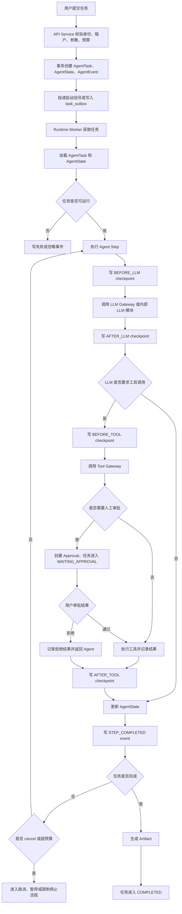
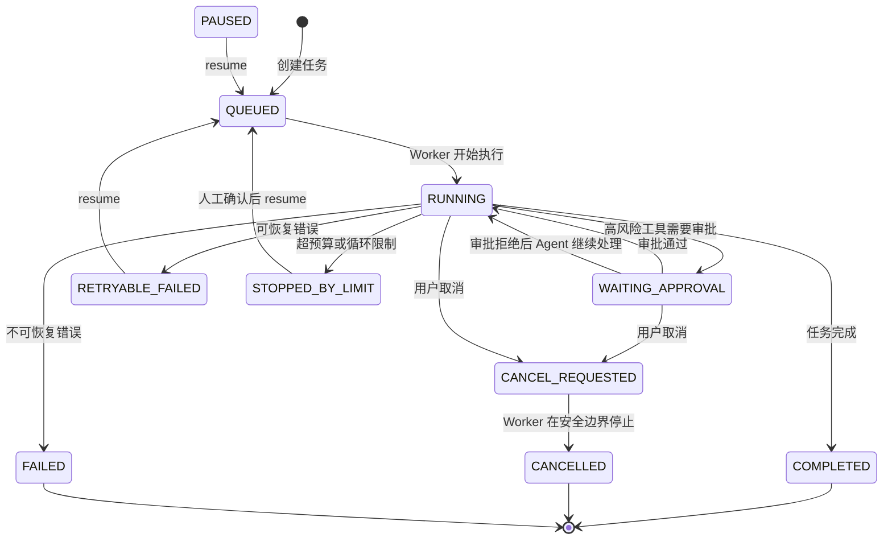
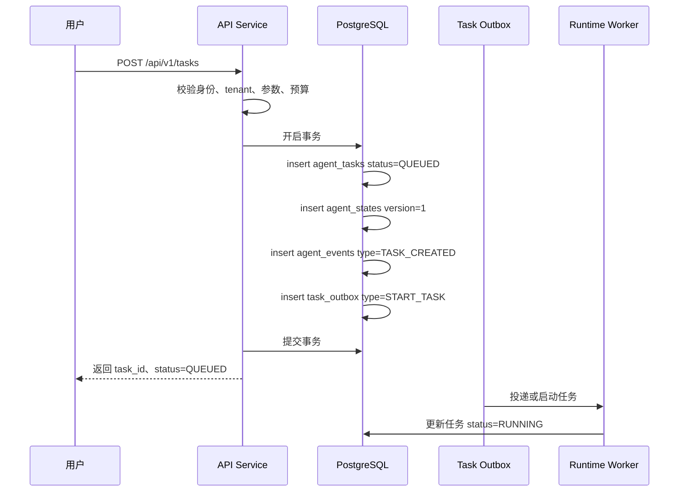
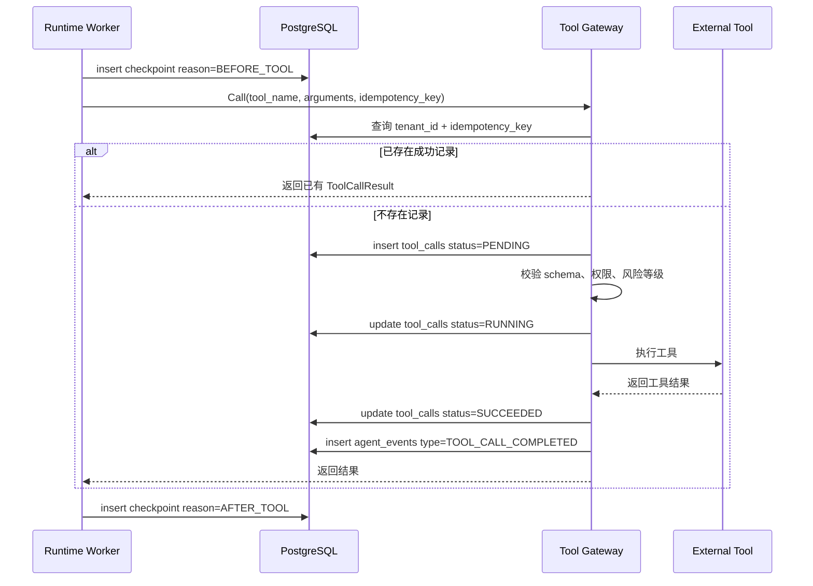
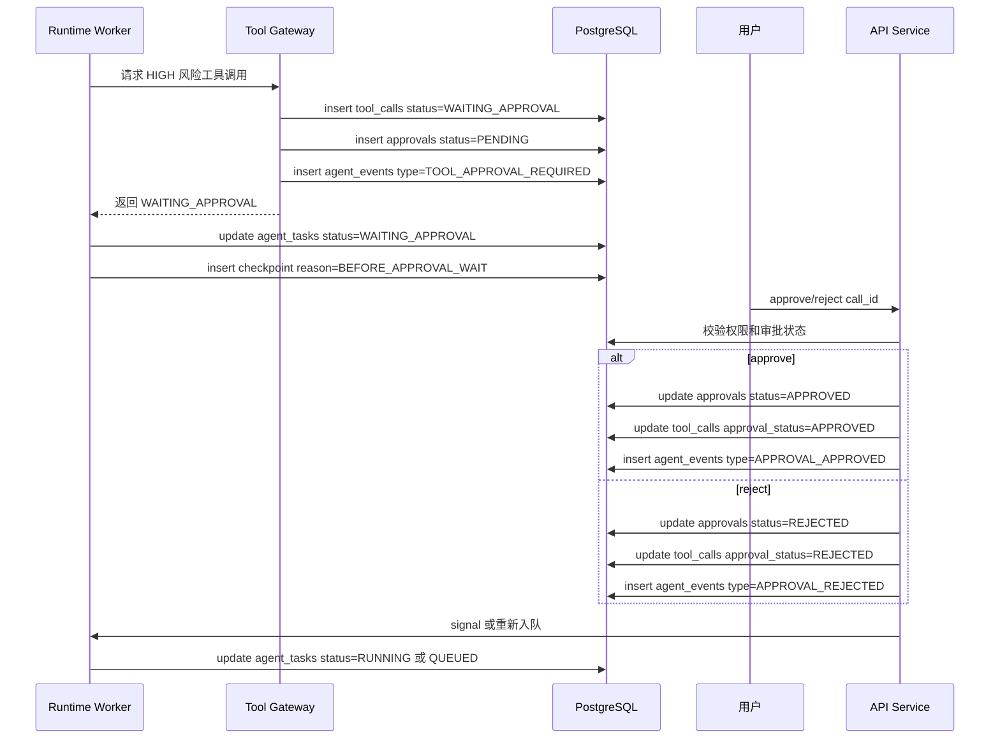
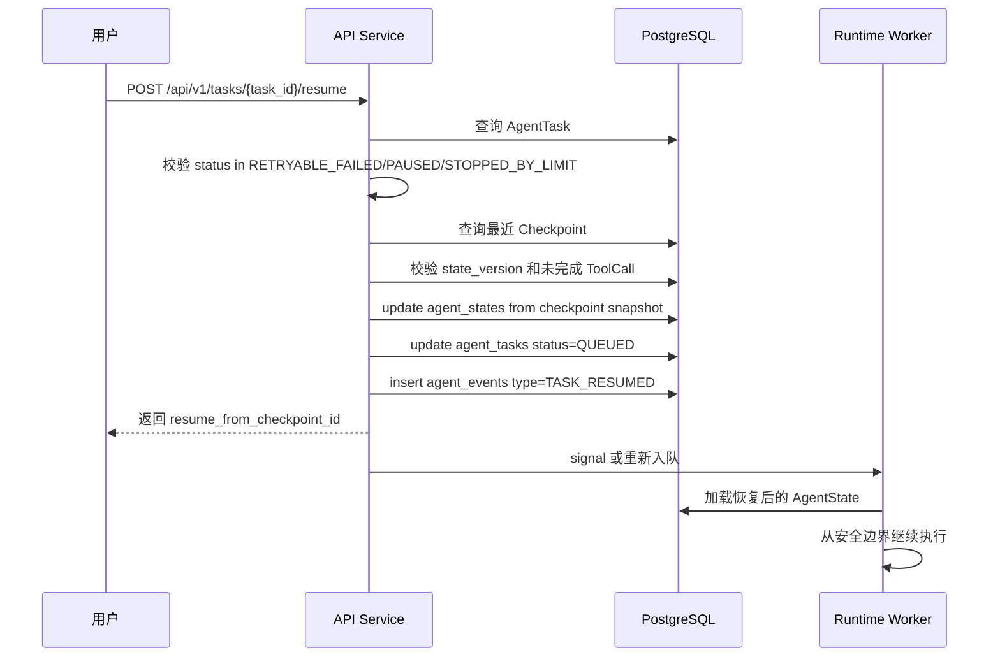
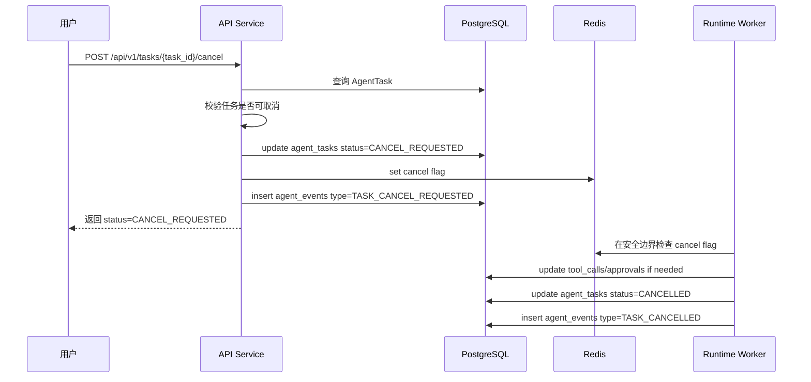

# Agent Runtime 核心流程

## 1. 文档目的

本文档描述 Agent Runtime 的系统主流程和最小闭环，覆盖创建任务、Agent 执行、工具调用、人工审批、checkpoint、resume 和 cancel。后续 API、数据库、Runtime Worker、Tool Gateway 和审批模块实现必须与本文档流程一致。

## 2. 系统主流程总览



## 3. 最小闭环

MVP 最小闭环必须覆盖以下状态转移：

```text
QUEUED
  -> RUNNING
  -> WAITING_APPROVAL
  -> RUNNING
  -> COMPLETED
```

同时必须覆盖以下异常转移：

```text
RUNNING
  -> CANCEL_REQUESTED
  -> CANCELLED
```

```text
RUNNING
  -> RETRYABLE_FAILED
  -> QUEUED
  -> RUNNING
```

```text
RUNNING
  -> STOPPED_BY_LIMIT
```

## 4. 任务状态机



状态约束：

1. `COMPLETED`、`CANCELLED`、`FAILED` 是终态，默认不能 resume。
2. `RETRYABLE_FAILED`、`PAUSED`、`STOPPED_BY_LIMIT` 可以 resume。
3. `WAITING_APPROVAL` 只能由审批决策、审批过期或 cancel 推进。
4. `CANCEL_REQUESTED` 不是终态，Worker 必须在安全边界确认并转为 `CANCELLED`。

## 5. 创建任务流程

### 5.1 流程图



### 5.2 关键规则

1. 创建任务必须在数据库事务内完成 `AgentTask`、`AgentState`、`AgentEvent` 和 outbox 写入。
2. API 返回后任务仍可能只是 `QUEUED`，不能同步等待 Agent 完成。
3. `task_id` 必须全局唯一。
4. 如果启动 Worker 或 Workflow 失败，由 outbox 后台补偿。
5. 同一用户重复请求创建任务时，后续可通过 `client_request_id` 实现幂等；MVP 可预留字段。

## 6. Agent 执行流程

### 6.1 Step 主循环

```text
加载任务
  -> 校验 task.status 是否为 QUEUED/RUNNING
  -> 更新为 RUNNING
  -> 加载 AgentState
  -> 检查 cancel flag
  -> 检查预算
  -> 写 STEP_STARTED event
  -> 写 BEFORE_LLM checkpoint
  -> 调用 LLM
  -> 写 AFTER_LLM checkpoint
  -> 解析 LLM 输出
  -> 如果需要工具，进入工具调用流程
  -> 更新 AgentState.version
  -> 写 STEP_COMPLETED event
  -> 判断完成、继续、失败、暂停或停止
```

### 6.2 安全边界

Runtime Worker 只能在以下位置安全停止或恢复：

| 边界 | 可执行动作 |
| --- | --- |
| step 开始前 | cancel、budget check、resume |
| LLM 调用前 | cancel、checkpoint、失败恢复 |
| LLM 调用后 | checkpoint、解析失败恢复 |
| 工具调用前 | cancel、checkpoint、幂等检查 |
| 工具调用后 | checkpoint、结果持久化 |
| 进入审批等待前 | checkpoint、任务状态切换 |
| Activity 重试前 | cancel、resume、预算检查 |

禁止在以下位置强制停止：

1. 数据库事务提交一半时。
2. 外部工具副作用执行中。
3. 已发送外部请求但尚未记录 `ToolCall` 时。

## 7. 工具调用流程

### 7.1 LOW/MEDIUM 风险工具



### 7.2 工具幂等规则

工具幂等键推荐格式：

```text
hash(task_id + step_id + tool_name + normalized_arguments)
```

规则：

1. `tenant_id + idempotency_key` 必须唯一。
2. Tool Gateway 执行外部工具前必须先写入 `ToolCall`。
3. 恢复时如果发现相同幂等键已有成功结果，直接返回已有结果。
4. 恢复时如果发现相同幂等键正在执行或状态不明，必须进入人工检查或重试保护流程，不能直接重复调用高风险工具。

## 8. 人工审批流程

### 8.1 流程图



### 8.2 审批决策处理

| 决策 | 处理方式 |
| --- | --- |
| approve | Tool Gateway 继续执行原工具调用 |
| reject | Tool Gateway 不执行工具，将拒绝结果返回给 Agent |
| expired | 关闭审批，任务进入 `PAUSED` 或 `RETRYABLE_FAILED` |
| cancel | 关闭审批，任务进入 `CANCEL_REQUESTED` |

### 8.3 审批幂等规则

1. 同一个 `call_id` 只能有一个 `Approval`。
2. approve/reject 如果重复提交，返回已存在的最终状态。
3. 已经 `APPROVED` 的审批不能改为 `REJECTED`。
4. 已经 `REJECTED` 的审批不能改为 `APPROVED`。
5. 审批决策和 event 写入必须在同一事务中完成。

## 9. Checkpoint 流程

### 9.1 创建 checkpoint

```text
Runtime Worker 到达安全边界
  -> 读取当前 AgentState
  -> 读取当前最新 event_id
  -> 构造 state_snapshot
  -> insert checkpoints
  -> insert agent_events type=CHECKPOINT_CREATED
```

### 9.2 checkpoint 内容

`state_snapshot` 至少包含：

```json
{
  "schema_version": 1,
  "task_id": "task_01",
  "current_plan": {},
  "current_step": 3,
  "memory_summary": "前序执行摘要",
  "constraints": {},
  "artifacts": [],
  "loop_fingerprints": [],
  "pending_tool_call_id": null,
  "created_reason": "BEFORE_TOOL"
}
```

### 9.3 checkpoint 写入规则

1. checkpoint 只能在安全边界写入。
2. checkpoint 必须引用 `state_version`。
3. checkpoint 必须记录 `event_offset`。
4. checkpoint 创建失败时，不能继续执行高风险外部调用。
5. checkpoint 事件写入失败时，checkpoint 记录仍然是恢复依据，但需要错误日志提示 timeline 不完整。

## 10. Resume 流程

### 10.1 流程图



### 10.2 resume 前置校验

| 校验项 | 失败处理 |
| --- | --- |
| 任务状态是否可恢复 | 返回不可恢复错误 |
| 最近 checkpoint 是否存在 | 返回无 checkpoint 错误 |
| checkpoint 的 `state_version` 是否有效 | 返回状态版本不一致错误 |
| checkpoint 后是否存在未完成 ToolCall | 进入工具幂等检查或人工处理 |
| 有副作用工具是否已有执行结果 | 有结果则复用，无明确结果则不能直接重放 |
| 预算是否允许继续 | 不允许则维持 `STOPPED_BY_LIMIT` |

### 10.3 resume 幂等规则

1. 同一个 `task_id + checkpoint_id` 重复 resume，只能产生一次有效恢复动作。
2. 如果任务已经从该 checkpoint 恢复并进入 `QUEUED` 或 `RUNNING`，重复请求返回当前状态。
3. resume 不得清空历史事件。
4. resume 必须写入新的 `TASK_RESUMED` 事件，用于审计。

## 11. Cancel 流程

### 11.1 流程图



### 11.2 cancel 可执行状态

| 当前状态 | cancel 结果 |
| --- | --- |
| `QUEUED` | 直接进入 `CANCELLED` 或 `CANCEL_REQUESTED` 后很快确认 |
| `RUNNING` | 进入 `CANCEL_REQUESTED`，Worker 安全停止后进入 `CANCELLED` |
| `WAITING_APPROVAL` | 关闭 pending approval，进入 `CANCELLED` |
| `PAUSED` | 直接进入 `CANCELLED` |
| `RETRYABLE_FAILED` | 直接进入 `CANCELLED` |
| `COMPLETED` | 幂等返回 `COMPLETED`，不取消 |
| `CANCELLED` | 幂等返回 `CANCELLED` |
| `FAILED` | 默认不取消，返回当前终态 |

### 11.3 cancel 安全规则

1. cancel 不强杀 goroutine。
2. cancel 不回滚已经完成的外部工具副作用。
3. Worker 必须在 step、LLM、tool、checkpoint 等安全边界检查 cancel flag。
4. 如果任务正在等待审批，cancel 必须关闭 pending approval。
5. cancel 多次调用必须返回稳定状态。

## 12. 数据一致性边界

### 12.1 创建任务事务

必须在同一事务中完成：

```text
insert agent_tasks
insert agent_states
insert agent_events TASK_CREATED
insert task_outbox START_TASK
```

### 12.2 审批事务

必须在同一事务中完成：

```text
update approvals
update tool_calls
insert agent_events APPROVAL_APPROVED/APPROVAL_REJECTED
```

### 12.3 工具调用事务边界

禁止在数据库事务中调用外部工具。正确边界：

```text
事务 1：写 ToolCall PENDING、写 BEFORE_TOOL checkpoint
外部调用：执行工具
事务 2：写 ToolCall result、写 AFTER_TOOL checkpoint、写 event
```

### 12.4 checkpoint 与外部调用

有副作用工具调用前必须先完成：

```text
ToolCall PENDING 已写入
BEFORE_TOOL checkpoint 已写入
idempotency_key 已生成
```

否则不能执行外部工具。

## 13. 核心事件顺序示例

一个包含高风险工具审批的成功任务，timeline 应类似：

```text
1  TASK_CREATED
2  TASK_STARTED
3  STEP_STARTED
4  CHECKPOINT_CREATED reason=BEFORE_LLM
5  LLM_STARTED
6  LLM_COMPLETED
7  CHECKPOINT_CREATED reason=AFTER_LLM
8  TOOL_CALL_REQUESTED
9  CHECKPOINT_CREATED reason=BEFORE_TOOL
10 TOOL_APPROVAL_REQUIRED
11 TASK_WAITING_APPROVAL
12 CHECKPOINT_CREATED reason=BEFORE_APPROVAL_WAIT
13 APPROVAL_APPROVED
14 TOOL_CALL_STARTED
15 TOOL_CALL_COMPLETED
16 CHECKPOINT_CREATED reason=AFTER_TOOL
17 STEP_COMPLETED
18 ARTIFACT_CREATED
19 TASK_COMPLETED
```

一个取消任务的 timeline 应类似：

```text
1 TASK_CREATED
2 TASK_STARTED
3 STEP_STARTED
4 CHECKPOINT_CREATED reason=BEFORE_LLM
5 TASK_CANCEL_REQUESTED
6 TASK_CANCELLED
```

一个恢复任务的 timeline 应类似：

```text
1 TASK_CREATED
2 TASK_STARTED
3 STEP_STARTED
4 CHECKPOINT_CREATED reason=BEFORE_TOOL
5 TASK_FAILED
6 TASK_RESUMED
7 TASK_STARTED
8 TOOL_CALL_COMPLETED
9 CHECKPOINT_CREATED reason=AFTER_TOOL
10 TASK_COMPLETED
```

## 14. 模块职责对照

| 模块 | 在核心流程中的职责 |
| --- | --- |
| API Service | 创建任务、查询任务、审批、cancel、resume、查询 timeline 和 artifacts |
| Runtime Worker | 执行 Agent 主循环、预算检查、cancel 检查、checkpoint、resume |
| Tool Gateway | 工具注册、参数校验、权限校验、风险识别、幂等、工具执行 |
| LLM Gateway | MVP 可内置，负责模型调用、超时、token 用量记录 |
| Event Repository | 追加写入 `AgentEvent`，支持 timeline 查询 |
| Approval Usecase | 创建审批、处理审批决策、写审批事件 |
| Artifact Usecase | 保存任务产物和大工具结果 |

## 15. 最小闭环验收

| 验收项 | 验收方法 |
| --- | --- |
| 创建任务 | 调用创建任务 API，返回 `task_id` 和 `QUEUED` |
| Agent 执行 | Worker 将任务推进到 `RUNNING` 并写入 step event |
| 工具调用 | LOW 工具直接执行并写入 `ToolCall` |
| 人工审批 | HIGH 工具使任务进入 `WAITING_APPROVAL` |
| checkpoint | LLM 和工具前后均能查询到 checkpoint |
| resume | 可恢复失败任务能从 checkpoint 继续 |
| cancel | `RUNNING` 或 `WAITING_APPROVAL` 任务能进入 `CANCELLED` |
| artifact | 成功任务能查询到至少一个产物 |
| timeline | 可按 event_id 顺序还原任务执行过程 |

