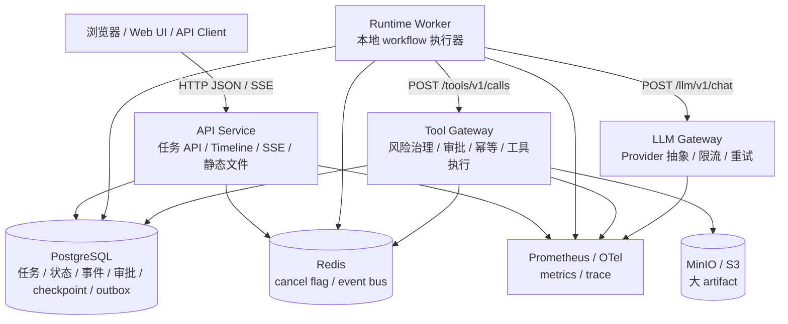

# StableAgent 完整源码解析文档

- 生成日期: 2026-07-08
- 对照设计: `设计方案.md`
- 代码基线: 当前 `feature` 分支工作区
- 文档目标: 从项目架构、源码分层、功能调用链、关键实现和核心思想几个维度解释 StableAgent 代码库，让未参与项目的人也能顺着本文理解系统如何运行。

## 一、项目定位与设计基线

StableAgent 是一个以稳定性为核心的生产级通用 Agent 执行平台。设计方案要求系统支持长任务可恢复执行、工具调用安全治理、人工审批、执行 timeline、checkpoint、cancel/resume 和完整可观测 trace。

当前代码库遵循设计方案中的生产级服务拆分，但为了本地生产闭环没有直接接入 Temporal SDK、gRPC 和真实 LLM Provider，而是用本地轮询式 Runtime Worker、HTTP JSON 网关和确定性 Mock Provider 实现同样的核心语义。仓库保留了这些生产组件的替换点，例如 `workflow_id`、outbox、`Provider` 接口、对象存储接口和 OpenTelemetry 初始化。

设计方案中的推荐服务边界是:

```text
api-service
runtime-worker
tool-gateway
llm-gateway
web-ui
```

当前源码的实际入口与职责如下:

| 服务 | 入口 | 默认端口 | 主要职责 |
| --- | --- | ---: | --- |
| API Service | `cmd/api-service/main.go` | 8080 | 用户 API、任务创建/查询、审批、取消、恢复、timeline/SSE、静态前端托管 |
| Runtime Worker | `cmd/runtime-worker/main.go` | 8081 | outbox 派发、任务推进、LLM/工具调用编排、checkpoint、预算、循环检测、审批过期 |
| Tool Gateway | `cmd/tool-gateway/main.go` | 8082 | 工具目录、参数校验、风险分级、租户策略、幂等、审批、Mock 工具执行、artifact 保存 |
| LLM Gateway | `cmd/llm-gateway/main.go` | 8083 | LLM 统一入口、prompt 版本、租户限流、超时、重试、确定性 Mock 计划生成 |
| Web UI | `web-ui/src/app.js` | 随 API 托管 | 本地控制台，支持创建任务、查看 timeline、审批工具调用、查看 checkpoint/artifact |

## 二、总体架构

### 2.1 架构图



### 2.2 分层原则

代码按照 `docs/development-standards.md` 中的目录规范组织:

| 层级 | 目录 | 作用 |
| --- | --- | --- |
| 服务入口 | `cmd/*` | 只负责调用统一启动器，不放业务逻辑 |
| 服务组装 | `internal/app/*` | 初始化数据库、Redis、对象存储、用例服务并注册路由 |
| 用例层 | `internal/usecase/*` | 承载业务流程，例如创建任务、运行 step、审批工具调用 |
| 领域层 | `internal/domain/*` | 承载稳定业务规则，例如状态机、预算、事件类型、工具风险、循环检测 |
| 基础设施 | `internal/infra/*` | PostgreSQL、Redis、MinIO 等外部依赖适配 |
| 传输层 | `internal/transport/http` | HTTP server、中间件、统一 JSON 响应、健康检查 |
| 安全 | `internal/security/*` | JWT 认证、租户上下文、任务权限判断 |
| 可观测 | `internal/observability/*` | slog、Prometheus、OpenTelemetry |
| 公共包 | `pkg/*` | 统一错误、ID、版本信息 |
| 数据库 | `db/migrations` / `db/queries` | schema migration 与 sqlc 查询定义 |
| 前端 | `web-ui` | React ESM 静态控制台 |

这套分层的核心思想是“入口薄、用例厚、领域规则独立、基础设施可替换”。例如 `cmd/api-service/main.go` 只有启动调用，真正的路由组装在 `internal/app/api/routes.go`，创建任务流程在 `internal/usecase/taskapi/service.go`，任务状态规则在 `internal/domain/task/status.go`。

## 三、服务启动链路

四个服务入口都使用同一个启动器 `internal/app/service.go`:

```text
cmd/<service>/main.go
  -> app.RunHTTPService(serviceName, defaultAddr, RegisterRoutes)
      -> config.Load()
      -> logging.New()
      -> tracing.Setup()
      -> chi.NewRouter()
      -> 注册 Recovery / RequestID / Tracing / Metrics / AccessLog
      -> RegisterHealthRoutes()
      -> 注册 /metrics
      -> 调用各服务 RegisterRoutes()
      -> httpserver.Run()
      -> 收到 SIGTERM/SIGINT 后优雅关闭
```

`RunHTTPService` 统一处理服务生命周期，因此各服务天然拥有一致的健康检查、日志格式、request_id、metrics 和 trace 初始化方式。中间件顺序也在这里固定，避免每个服务重复实现公共能力。

配置由 `internal/config/config.go` 加载，优先读取服务前缀环境变量，例如 `API_SERVICE_HTTP_ADDR`，再回退到全局环境变量和默认值。默认会尝试读取 `config/local.env`，但不会覆盖外部已经注入的环境变量。

## 四、HTTP 传输层解析

### 4.1 中间件

`internal/transport/http/middleware.go` 提供以下中间件:

| 中间件 | 作用 |
| --- | --- |
| `WithRecovery` | 捕获 panic，写统一错误响应，记录堆栈 |
| `WithRequestID` | 从 `X-Request-ID` 读取或生成 request_id，写入响应头和 context |
| `WithTracing` | 从 W3C TraceContext 提取上下文，创建 HTTP server span |
| `WithMetrics` | 记录 HTTP 请求量和耗时 |
| `WithAccessLog` | 记录 method、path、status、duration、remote_addr |

`statusRecorder` 包装 `http.ResponseWriter`，记录状态码，并实现 `Flush()` 和 `Unwrap()`。这两个方法很关键:

- `Flush()` 让 SSE 可以主动把事件刷到客户端。
- `Unwrap()` 让 `http.NewResponseController(w)` 能穿透包装，清理长连接写超时。

### 4.2 统一响应结构

`internal/transport/http/json.go` 定义成功和错误响应:

```json
{
  "data": {}
}
```

```json
{
  "error": {
    "code": "INVALID_ARGUMENT",
    "message": "参数错误",
    "request_id": "..."
  }
}
```

业务错误由 `pkg/errors/errors.go` 的 `Code` 和 `Error` 表达，再映射到 HTTP 状态码。这样 handler 不需要关心具体状态码，只需要返回统一应用错误。

## 五、安全模型

### 5.1 JWT 认证

`internal/security/authn/jwt.go` 实现 HS256 JWT 校验:

```text
Authorization: Bearer <jwt>
  -> bearerToken()
  -> ParseAndVerifyJWT()
      -> 校验三段结构
      -> 校验 alg == HS256
      -> HMAC-SHA256 常量时间比较签名
      -> 解析 tenant_id / user_id / sub / role / exp / nbf
      -> 校验租户和用户字段
  -> WithUser()
  -> tenant.WithTenantID()
```

`user_id` 可以从自定义 claim `user_id` 或标准 claim `sub` 取得，`role` 默认为 `member`。

### 5.2 租户隔离与 RBAC

`internal/security/tenant/context.go` 保存租户上下文。API handler 中的 `principalFromRequest()` 会再次校验用户 claims 中的 `tenant_id` 与租户上下文一致，避免伪造跨租户访问。

`internal/security/authz/task.go` 定义任务读取权限:

- `admin` / `owner`: 可读取租户内全部任务。
- `member`: 只能读取自己创建的任务。

所有任务查询、事件查询、工具调用列表、checkpoint 列表和 artifact 列表都会先按 `tenant_id` 查询，再做用户权限判断。

## 六、数据库模型与数据访问

### 6.1 核心表

主要 schema 位于 `db/migrations/000002_week2_core_models.up.sql`，补充迁移位于 `000003_local_production_loop.up.sql` 和 `000004_design_alignment.up.sql`。

| 表 | 作用 |
| --- | --- |
| `tenants` | 租户基础信息 |
| `users` | 租户内用户、角色和状态 |
| `agent_tasks` | 任务主体、状态、预算、trace、最后错误 |
| `agent_states` | Agent 当前计划、step、记忆摘要、约束、artifact 引用、循环指纹和版本 |
| `agent_events` | timeline 事件流，按 `event_id` 单调递增 |
| `tool_calls` | 工具调用审计、参数 hash、幂等键、状态、风险和审批状态 |
| `approvals` | 高风险工具调用审批记录 |
| `checkpoints` | 状态快照、事件偏移、恢复原因 |
| `artifacts` | 任务产物，支持 PostgreSQL 内联或 S3/MinIO 外部存储 |
| `task_outbox` | 启动/恢复 workflow 的事务消息 |
| `tenant_tool_policies` | 租户级工具策略 |
| `task_idempotency_keys` | 创建任务的客户端幂等键 |

### 6.2 约束设计

数据库层主动承担一致性约束:

- 所有任务相关表都包含 `tenant_id`，并通过复合外键 `(tenant_id, task_id)` 绑定任务。
- `tool_calls` 对 `(tenant_id, idempotency_key)` 做唯一约束，保证工具幂等。
- `approvals` 对 `call_id` 做唯一约束，保证一个工具调用只有一个审批。
- JSON 字段使用 `jsonb_typeof` check 约束，避免对象/数组类型混乱。
- `agent_states.version` 配合 `UpdateAgentStateOptimistic` 实现乐观锁。

### 6.3 sqlc 查询

`db/queries/*.sql` 由 sqlc 生成 `internal/infra/postgres/db/*.sql.go`。用例层多数直接使用 `db.Queries`，仓储层 `internal/infra/postgres/repository` 提供了轻量封装和错误映射，主要用于单元测试和后续解耦。

关键查询包括:

- `CreateAgentTask`、`GetAgentTask`、`ListAgentTasksByTenant`、`MarkAgentTaskFailed`。
- `UpdateAgentStateOptimistic`。
- `CreateAgentEvent`、`ListAgentEventsByTask`。
- `CreateToolCall`、`GetToolCallByIdempotencyKey`、`StartToolCall`、`CompleteToolCall`。
- `CreateApproval`、`ExpireApproval`、`ListExpiredPendingApprovals`。
- `CreateCheckpoint`、`GetLatestCheckpointByReason`、`PruneCheckpoints`。
- `CreateTaskOutboxMessage`、`ListPendingTaskOutboxMessages`、`ResetStaleTaskOutboxProcessing`。

## 七、领域层规则

### 7.1 任务状态机

`internal/domain/task/status.go` 定义状态:

```text
QUEUED -> RUNNING -> SUCCEEDED
QUEUED/RUNNING -> CANCELING -> CANCELED
RUNNING -> WAITING_APPROVAL -> QUEUED/RUNNING
RUNNING -> FAILED
RUNNING -> STOPPED_BY_LIMIT
FAILED/PAUSED/STOPPED_BY_LIMIT/RETRYABLE_FAILED -> QUEUED
```

`CanResume()` 明确只允许 `FAILED`、`RETRYABLE_FAILED`、`PAUSED`、`STOPPED_BY_LIMIT` 恢复，符合设计方案 §5.4。

### 7.2 预算模型

`internal/domain/task/budget.go` 定义四维预算:

- `max_steps`
- `max_tokens`
- `max_tool_calls`
- `max_cost_usd`

创建任务时 `ValidateBudget()` 校验预算边界。Runtime Worker 在每个 step 边界调用 `checkBudget()`，达到预算上限后调用 `stopTaskByLimit()`，将任务置为 `STOPPED_BY_LIMIT`，并写入 `TASK_STOPPED_BY_LIMIT` 事件。

### 7.3 事件模型

`internal/domain/event/event.go` 定义 timeline 事件类型，例如:

- `TASK_CREATED`
- `TASK_STARTED`
- `STEP_STARTED`
- `LLM_CALL_STARTED`
- `LLM_CALL_COMPLETED`
- `TOOL_CALL_STARTED`
- `TOOL_CALL_COMPLETED`
- `TOOL_APPROVAL_REQUIRED`
- `TOOL_APPROVAL_DECIDED`
- `CHECKPOINT_CREATED`
- `ARTIFACT_SAVED`
- `TASK_COMPLETED`
- `TASK_FAILED`
- `TASK_CANCELLED`

事件结构包含 `input`、`output`、`metadata`、`trace_id`、`span_id`。`metadata` 统一携带 `user_id`、`request_id`、`source`、`workflow_id` 等审计信息。

### 7.4 工具风险与 schema

`internal/domain/toolcall/toolcall.go` 定义风险等级:

```text
LOW      -> 默认自动执行
MEDIUM   -> 默认自动执行，可被租户策略 DENY
HIGH     -> 必须人工审批
CRITICAL -> 本地闭环默认禁止
```

内置工具:

| 工具 | 风险 | 作用 |
| --- | --- | --- |
| `read_document` | LOW | 读取上下文文档摘要 |
| `write_artifact` | MEDIUM | 写入任务产物 |
| `send_external_message` | HIGH | 模拟外部消息发送，需要审批 |
| `dangerous_admin_action` | CRITICAL | 模拟危险管理操作，默认禁止 |

`internal/domain/toolcall/schema.go` 实现 JSON Schema 子集校验，支持 object、properties、required、additionalProperties、类型校验和字符串长度校验。

### 7.5 循环检测

`internal/domain/loopdetect/loopdetect.go` 用工具名、参数 hash 和 LLM 输出内容生成 step 指纹。Runtime Worker 在执行工具前检测尾部连续相同指纹次数，默认阈值为 3。达到阈值后任务进入 `STOPPED_BY_LIMIT`，错误码为 `LOOP_DETECTED`。

## 八、API Service 源码解析

### 8.1 路由注册

`internal/app/api/routes.go` 负责 API Service 组装:

```text
RegisterRoutes()
  -> postgres.NewPool()
  -> eventapi.NewHub()
  -> redis.NewEventBus()
  -> redis.NewCancelStore()
  -> eventapi.NewService()
  -> taskapi.NewServiceWithEventNotifierAndCancelStore()
  -> 启动 Redis EventBus Subscribe
  -> registerPublicRoutes()
  -> registerTaskRoutes()
  -> registerWebRoutes()
```

API 路由中的任务接口统一挂载 JWT middleware。静态前端路由由 `registerWebRoutes()` 处理，并且 `/api/*` 未命中时仍返回 JSON 错误，不会被前端 `index.html` 吞掉。

### 8.2 创建任务调用链

入口:

```text
POST /api/v1/tasks
```

调用链:

```text
taskHandler.createTask()
  -> principalFromRequest()
  -> decodeJSONBody()
  -> taskapi.Service.CreateTask()
      -> tracing.StartSpan("task.create")
      -> task.NormalizeGoal()
      -> task.ValidateBudget()
      -> getTaskByClientRequestID()
      -> task.NormalizeJSONObject(constraints)
      -> ids.New("task" / "trace" / "span")
      -> BeginTx()
          -> CreateAgentTask(status=QUEUED)
          -> CreateAgentState(current_step=0)
          -> CreateAgentEvent(type=TASK_CREATED)
          -> CreateTaskOutboxMessage(event_type=START_WORKFLOW)
          -> insertTaskIdempotencyKey()
      -> Commit()
      -> eventNotifier.NotifyPersisted()
  -> httpserver.WriteData(201)
```

关键实现点:

- `client_request_id` 非空时先查幂等记录，重复请求直接返回原任务。
- 任务、状态、事件、outbox 和幂等键在同一数据库事务内提交。
- 事件在事务提交后才推送，避免客户端收到数据库尚不可读的 event。
- outbox 与任务同事务写入，保证任务创建成功后最终会被 worker 扫描。

### 8.3 查询任务列表调用链

入口:

```text
GET /api/v1/tasks?status=&page=&page_size=&sort=created_at_desc
```

调用链:

```text
taskHandler.listTasks()
  -> principalFromRequest()
  -> parsePositiveIntQuery(page/page_size)
  -> taskapi.Service.ListTasks()
      -> normalizePagination()
      -> task.ParseStatus()
      -> authz.CanListTenantTasks()
      -> ListAgentTasksByTenant* 或 ListAgentTasksByUser*
      -> 多取一条判断 has_more
      -> taskSummaryFromDB()
  -> WriteData(200)
```

管理员和所有者查询租户维度，普通成员查询用户维度。列表只支持 `created_at_desc`，这是为了匹配现有索引并避免开放慢查询排序。

### 8.4 查询任务详情调用链

```text
GET /api/v1/tasks/{task_id}
  -> taskHandler.getTask()
  -> taskapi.Service.GetTask()
      -> GetAgentTask(tenant_id, task_id)
      -> authz.CanReadTask()
      -> GetAgentState()
      -> taskDetailFromDB()
```

任务详情响应包含目标、状态、当前 step、预算、预算用量、trace_id 和最后错误信息。

### 8.5 Timeline REST 查询调用链

```text
GET /api/v1/tasks/{task_id}/events?after_event_id=&limit=&type=
  -> eventHandler.listTaskEvents()
  -> eventapi.Service.ListTaskEvents()
      -> AuthorizeTask()
          -> GetAgentTask()
          -> authz.CanReadTask()
      -> listAuthorizedTaskEvents()
          -> normalizeEventLimit()
          -> event.NormalizeType()
          -> ListAgentEventsByTask 或 ListAgentEventsByTaskAndType
          -> 多取一条判断 has_more
          -> eventFromDB()
```

事件按 `event_id` 升序返回，并返回 `next_after_event_id` 供前端下一次增量拉取。

### 8.6 SSE 实时事件调用链

```text
GET /api/v1/tasks/{task_id}/events/stream
  -> eventHandler.streamTaskEvents()
      -> principalFromRequest()
      -> parseLastEventID()
      -> eventapi.AuthorizeTask()
      -> w.(http.Flusher)
      -> 清理 WriteDeadline
      -> 设置 text/event-stream 响应头
      -> Hub.Subscribe(tenant_id, task_id)
      -> sendBackfill()
          -> ListAuthorizedTaskEvents(after last id)
          -> writeSSEEvent()
      -> 循环等待:
          -> sub.C() 新事件
          -> heartbeat ticker
          -> request context done
```

SSE 事件格式:

```text
id: 123
event: agent_event
data: {"event_id":123,"task_id":"...","type":"STEP_COMPLETED",...}

```

`eventapi.Hub` 使用每个订阅者独立 buffered channel。慢客户端 channel 满时会被主动移除，客户端依靠 `Last-Event-ID` 重连补发。

Redis EventBus 用于跨 API 实例推送:

```text
eventapi.Append() / NotifyPersisted()
  -> hub.Publish()
  -> redis.EventBus.Publish()

API Service 启动时:
  -> redis.EventBus.Subscribe()
  -> eventService.PublishLocal()
  -> hub.Publish()
```

### 8.7 取消任务调用链

```text
POST /api/v1/tasks/{task_id}/cancel
  -> taskHandler.cancelTask()
  -> taskapi.Service.CancelTask()
      -> authorizeTaskAccess()
      -> 如果已是终态直接返回
      -> cancelStore.Set(taskID)
      -> UpdateAgentTaskStatus(CANCELING)
```

取消不是立即中断正在执行的外部调用，而是在 Runtime Worker 的安全边界生效:

```text
runtimeworker.processRunnableTasks()
  -> status == CANCELING 或 cancelStore.IsCanceled()
  -> finishCanceledTask()
      -> UpdateAgentTaskStatus(CANCELED)
      -> cancelStore.Clear()
      -> appendEvent(TASK_CANCELLED)
```

这种设计避免在数据库事务或外部调用中间强制打断，降低状态不一致风险。

### 8.8 恢复任务调用链

```text
POST /api/v1/tasks/{task_id}/resume
  -> taskHandler.resumeTask()
  -> taskapi.Service.ResumeTask()
      -> authorizeTaskAccess()
      -> QUEUED/RUNNING 幂等返回
      -> WAITING_APPROVAL 返回冲突
      -> task.CanResume()
      -> GetLatestCheckpoint()
      -> BeginTx()
          -> UpdateAgentTaskStatus(QUEUED)
          -> createStartWorkflowOutbox()
          -> appendEvent(TASK_RESUMED)
      -> Commit()
      -> notifyPersistedEvents()
```

恢复逻辑不直接调用 worker，而是写入 `START_WORKFLOW` outbox，由 worker 扫描后重新推进任务。这样恢复操作与创建任务保持相同的异步编排模型。

### 8.9 审批工具调用调用链

入口:

```text
POST /api/v1/tool-calls/{call_id}/approve
POST /api/v1/tool-calls/{call_id}/reject
```

调用链:

```text
taskHandler.decideToolCall()
  -> taskapi.Service.DecideToolCall()
      -> GetToolCall()
      -> authorizeTaskAccess(call.TaskID)
      -> GetApprovalByCall()
      -> 如果审批已处理:
          -> 相同决策幂等返回
          -> 冲突决策返回 409
      -> BeginTx()
          -> decideApprovalByCall(status=PENDING 条件更新)
          -> updateToolCallAfterDecision()
          -> UpdateAgentTaskStatus(approve=QUEUED, reject=FAILED)
          -> approve 时 createStartWorkflowOutbox()
          -> appendEvent(TOOL_APPROVAL_DECIDED)
          -> reject 时 appendEvent(TASK_FAILED)
      -> Commit()
      -> notifyPersistedEvents()
```

审批通过后，工具调用状态回到 `PENDING` 且审批状态为 `APPROVED`。Worker 恢复后再次调用 Tool Gateway，同一个幂等键命中已有工具调用，Tool Gateway 会执行已审批的 pending 调用。

## 九、Runtime Worker 源码解析

### 9.1 Worker 启动

`internal/app/worker/routes.go` 初始化:

```text
postgres.NewPool()
eventapi.NewHub()
redis.NewEventBus()
eventapi.NewService()
redis.NewCancelStore()
runtimeworker.NewService()
runtimeService.Start(workerCtx)
```

Worker 仍暴露 HTTP 状态路由 `/runtime/v1/status` 和通用健康检查，但核心执行逻辑在后台 goroutine 中运行。

### 9.2 主循环

`internal/usecase/runtimeworker/service.go`:

```text
Start()
  -> tick()
  -> 每 pollInterval tick()

tick()
  -> dispatchOutbox()
  -> processRunnableTasks()
  -> expireApprovals()
```

### 9.3 Outbox 派发

```text
dispatchOutbox()
  -> ResetStaleTaskOutboxProcessing(30s)
  -> ListPendingTaskOutboxMessages(limit=20)
  -> MarkTaskOutboxProcessing()
  -> markWorkflowStarted()
      -> workflow_id = task_id
      -> trace_id = payload.trace_id
  -> MarkTaskOutboxSent()
```

本地闭环中 `workflow_id` 直接使用 `task_id`。如果未来接入 Temporal，这里会替换成启动 Temporal Workflow 并写回真实 workflow id。

`ResetStaleTaskOutboxProcessing()` 用于修复 worker 在处理消息中途崩溃后遗留的 `PROCESSING` 消息，避免 outbox 永久卡死。

### 9.4 可运行任务扫描

```text
processRunnableTasks()
  -> 查询 status in ('QUEUED', 'CANCELING') limit 10
  -> CANCELING 或 Redis cancel flag:
      -> finishCanceledTask()
  -> 否则:
      -> runTask()
```

当前实现一次 tick 最多扫描 10 个任务，单个任务一次 `runTask()` 最多推进 100 个 step，作为预算之外的安全兜底。

### 9.5 任务执行主链路

```text
runTask(task)
  -> lockQueuedTask()
      -> 原子 UPDATE QUEUED -> RUNNING
  -> appendEvent(TASK_STARTED)
  -> for i < maxStepsPerRun:
      -> cancelStore.IsCanceled()
      -> checkBudget()
      -> GetAgentState()
      -> runStep()
      -> 非 stepAdvanced 则退出
```

`lockQueuedTask()` 使用条件更新防止多个 worker 同时执行同一个 `QUEUED` 任务。

### 9.6 单步执行调用链

```text
runStep(task, state)
  -> tracing.StartSpan("agent.step")
  -> appendEvent(STEP_STARTED)
  -> createCheckpoint("BEFORE_LLM")
  -> loadReusableLLMResponse()
      -> GetLatestCheckpointByReason("AFTER_LLM")
      -> 当前 step 匹配则复用 llm_response
  -> 未复用:
      -> appendEvent(LLM_CALL_STARTED)
      -> callLLM()
      -> appendEvent(LLM_CALL_COMPLETED)
      -> createCheckpoint("AFTER_LLM", llmResp)
  -> decodeFingerprints()
  -> 如果 llmResp.ToolCall != nil 且非 final:
      -> NormalizeArguments()
      -> loopdetect.BuildFingerprint()
      -> loopdetect.Detect()
      -> 命中循环则 stopTaskByLimit("LOOP_DETECTED")
      -> loopdetect.Append()
      -> callTool()
      -> WAITING_APPROVAL: 暂停退出
      -> FAILED: failTask()
      -> SUCCEEDED: toolCalled=true
  -> commitStep()
  -> 如果 llmResp.IsFinal:
      -> UpdateAgentTaskStatus(SUCCEEDED)
      -> appendEvent(TASK_COMPLETED)
```

关键点:

- `BEFORE_LLM` checkpoint 保证外部 LLM 调用前有恢复点。
- `AFTER_LLM` checkpoint 保存 LLM 输出，worker 崩溃恢复时可复用，避免重复生成计划。
- `AFTER_TOOL` checkpoint 保存工具后状态。
- DB 事务不会跨 LLM/Tool HTTP 调用，符合设计中的事务边界要求。
- 状态更新使用 `UpdateAgentStateOptimistic()` 乐观锁，避免并发覆盖状态。

### 9.7 LLM 调用

```text
callLLM()
  -> 构造 runtimeplan.ChatRequest
  -> postJSON(llmURL + "/llm/v1/chat")
      -> 注入 trace header
      -> 解析 {"data": ChatResponse}
  -> 记录 LLM metrics
```

请求结构位于 `internal/domain/runtimeplan/plan.go`，包含 task、tenant、goal、current_step 和 constraints。

### 9.8 工具调用

```text
callTool()
  -> NormalizeArguments()
  -> HashArguments()
  -> BuildIdempotencyKey(taskID, currentStep, toolName, argumentsHash)
  -> POST /tools/v1/calls
  -> 记录工具调用 metrics
```

幂等键由任务 ID、step、工具名和参数 hash 生成。只要同一 step 的同一工具参数不变，重复调用会命中同一条 `tool_calls` 记录。

### 9.9 提交 step

```text
commitStep()
  -> incrementBudgetUsage()
  -> current_plan = {model, prompt_version, content}
  -> UpdateAgentStateOptimistic(current_step + 1, version 条件)
  -> UpdateAgentTaskBudgetUsage()
  -> createCheckpoint("AFTER_TOOL")
  -> appendEvent(STEP_COMPLETED)
```

`incrementBudgetUsage()` 只在实际发生工具调用时累计 `used_tool_calls`，LLM 直接返回终态的 step 不会虚计工具调用。

### 9.10 审批过期

```text
expireApprovals()
  -> ListExpiredPendingApprovals(limit=20)
  -> ExpireApproval(status=PENDING 条件)
  -> FailToolCall(error=TOOL_APPROVAL_EXPIRED)
  -> UpdateToolCallApprovalStatus(EXPIRED)
  -> 如果任务 WAITING_APPROVAL:
      -> failTask()
  -> appendEvent(TOOL_APPROVAL_DECIDED, decision=EXPIRED)
```

过期处理与人工审批通过 `status='PENDING'` 条件更新互斥，避免并发重复决策。

## 十、LLM Gateway 源码解析

### 10.1 路由

`internal/app/llmgateway/routes.go`:

```text
GET  /llm/v1/status
POST /llm/v1/chat
```

`/llm/v1/chat` 解析 `runtimeplan.ChatRequest`，调用 `llmgateway.Service.Chat()`，返回统一 `data` 响应。

### 10.2 用例服务

`internal/usecase/llmgateway/service.go`:

```text
Chat(input)
  -> 校验 goal
  -> tenantRateLimiter.Allow(tenantID)
  -> ActivePrompt()
  -> for attempt <= retries:
      -> context.WithTimeout()
      -> provider.Chat()
      -> 成功则回填 PromptVersion
      -> 非可重试错误退出
      -> 可重试错误指数退避
  -> 返回 SERVICE_UNAVAILABLE
```

`Config` 支持单次 provider 超时、最大重试次数和每租户每分钟请求数。默认 `MaxRetries=2`，`RatePerMinute=600`。

### 10.3 Provider 抽象

`internal/usecase/llmgateway/provider.go` 定义:

```go
type Provider interface {
    Name() string
    Chat(ctx context.Context, input runtimeplan.ChatRequest, prompt PromptTemplate) (runtimeplan.ChatResponse, error)
}
```

生产接入 OpenAI、Anthropic 或内部模型时，只需要实现该接口，并把真实 provider 注入 `NewServiceWith()`。

### 10.4 确定性 Mock Provider

当前 `mockProvider` 按目标关键词生成计划:

| 目标关键词 | 行为 |
| --- | --- |
| 包含 `循环` 或 `loop` | 永远返回同一 `read_document` step，用于触发 LoopDetector |
| 包含 `危险` 或 `critical` | 返回 `dangerous_admin_action`，触发 CRITICAL 拒绝 |
| 包含 `高风险`、`审批`、`邮件` 或 `send` | 返回 `send_external_message`，触发人工审批 |
| 默认 | 两步计划: `read_document` -> `write_artifact`，之后返回 final |

token 使用量由 `estimateUsage()` 基于输入输出字符数稳定估算，保证本地测试可预测。

## 十一、Tool Gateway 源码解析

### 11.1 路由与依赖

`internal/app/toolgateway/routes.go`:

```text
RegisterRoutes()
  -> postgres.NewPool()
  -> eventapi.NewService()
  -> toolgateway.NewService()
  -> objectstore.NewMinIO()
      -> 成功则 service.WithObjectStore()
      -> 失败则 artifact 全部内联 PostgreSQL
  -> GET /tools/v1/catalog
  -> POST /tools/v1/calls
```

对象存储不可用不会阻止 Tool Gateway 启动，这是为了保证本地闭环和降级能力。

### 11.2 工具调用总链路

`internal/usecase/toolgateway/service.go`:

```text
Call(input)
  -> validateCallInput()
  -> NormalizeToolName()
  -> GetDefinition()
  -> NormalizeArguments()
  -> ValidateArguments(schema)
  -> applyTenantPolicy()
  -> GetToolCallByIdempotencyKey()
      -> 命中则 handleExistingCall()
  -> risk == CRITICAL:
      -> createRejectedCriticalCall()
  -> risk == HIGH:
      -> createApprovalCall()
  -> LOW/MEDIUM:
      -> createAndExecuteCall()
```

### 11.3 幂等处理

`insertToolCall()` 插入 `tool_calls`。如果数据库返回唯一键冲突 `23505`，说明另一个并发请求已经写入同一幂等键，函数会重新读取已有记录并返回。

`handleExistingCall()` 的行为:

- `WAITING_APPROVAL` 或 `PENDING approval`: 直接返回等待审批状态。
- `PENDING + APPROVED`: 执行已审批工具。
- 其他状态: 返回已有结果。

这让 Worker 崩溃恢复、审批后恢复和重复 HTTP 调用都能共享同一条工具调用记录。

### 11.4 高风险审批

```text
createApprovalCall()
  -> insertToolCall(status=WAITING_APPROVAL, approval_status=PENDING)
  -> ids.New("approval")
  -> CreateApproval(expires_at=now+24h)
  -> UpdateAgentTaskStatus(WAITING_APPROVAL)
  -> appendEvent(TOOL_APPROVAL_REQUIRED)
```

Tool Gateway 只创建审批和暂停任务，不直接处理人工决策。人工决策由 API Service 的审批接口完成。

### 11.5 CRITICAL 拒绝

```text
createRejectedCriticalCall()
  -> insertToolCall(status=FAILED, approval_status=REJECTED)
  -> FailToolCall(error=CRITICAL_TOOL_BLOCKED)
  -> appendEvent(TOOL_CALL_COMPLETED)
```

本地闭环中 CRITICAL 风险工具默认禁止执行，体现安全优先策略。

### 11.6 工具执行与 artifact

`executeTool()` 当前包含三个 Mock 执行器:

- `read_document`: 返回固定文档摘要。
- `write_artifact`: 调用 `writeArtifact()` 写入产物。
- `send_external_message`: 返回模拟外部消息发送结果。

`writeArtifact()` 的存储策略:

```text
构造 JSON 内容
  -> sha256Hex()
  -> 如果配置了 object store 且内容超过 inlineMaxBytes:
      -> store.Put()
      -> DB 保存 storage_backend=S3 和 storage_key
      -> 失败则降级内联存储
  -> 否则:
      -> DB content_json 内联保存
  -> CreateArtifact()
  -> appendEvent(ARTIFACT_SAVED)
```

## 十二、Event API 与 SSE 源码解析

`internal/usecase/eventapi/service.go` 是事件的统一用例层:

- `Append()` 写数据库事件并发布到本地 hub 和 Redis。
- `NotifyPersisted()` 用于其他事务提交后推送已落库事件。
- `AuthorizeTask()` 校验任务访问权限。
- `ListTaskEvents()` 查询 timeline。
- `ListAuthorizedTaskEvents()` 给 SSE backfill 使用，避免重复鉴权。

`internal/usecase/eventapi/hub.go` 是进程内发布订阅中心:

```text
Hub.subs: map[(tenantID, taskID)]set[Subscription]
Subscribe() -> 创建 buffered channel
Publish() -> 非阻塞发送，满了就移除慢客户端
Subscription.Close() -> 删除订阅并关闭 channel
```

它与 Redis EventBus 组合后形成“本地直接推送 + 跨实例广播”的事件分发模型。

## 十三、前端源码解析

当前前端位于 `web-ui`，`package.json` 没有 npm 依赖，运行时通过 ESM CDN 引入 React:

```js
import React from 'https://esm.sh/react@19.2.3';
import { createRoot } from 'https://esm.sh/react-dom@19.2.3/client';
```

`web-ui/scripts/build.mjs` 会把 `web-ui/src/app.js` 和 `web-ui/src/styles.css` 复制到 `web-ui/dist/assets`，并替换 `index.html` 中的资源路径。API Service 默认托管 `web-ui/dist`。

### 13.1 单文件工作台

`web-ui/src/app.js` 实现一个本地生产闭环工作台:

```text
App()
  -> 保存 JWT 到 localStorage
  -> loadTasks()
  -> createTask()
  -> loadTaskData()
  -> connectStream()
  -> mutateTask(cancel/resume)
  -> decideToolCall()
```

主要视图:

- Sidebar: JWT、目标输入、创建任务、任务列表。
- TaskSummary: 当前 step、trace、预算使用、SSE 状态。
- Timeline: 展示事件流。
- ToolCalls: 展示工具调用并提供审批按钮。
- ResourceList: 展示 checkpoint 和 artifact。

### 13.2 新拆分前端文件

工作区中还存在未跟踪的新拆分前端文件:

- `web-ui/src/api.js`
- `web-ui/src/ui.js`
- `web-ui/src/pages/dashboard.js`
- `web-ui/src/pages/tasks.js`
- `web-ui/src/pages/task-detail.js`

它们把 API 调用、SSE 解析、通用 UI、仪表盘、任务列表和任务详情拆分成模块。当前 `web-ui/scripts/build.mjs` 仍复制 `src/app.js`，因此实际构建入口仍是单文件工作台。后续如果切换到新拆分版本，需要同步更新 build 脚本和入口引用。

## 十四、关键功能调用链汇总

### 14.1 普通任务完成链路

```text
用户 POST /api/v1/tasks
  -> API 创建 task/state/event/outbox
  -> Worker dispatchOutbox 回填 workflow_id
  -> Worker lock QUEUED -> RUNNING
  -> BEFORE_LLM checkpoint
  -> LLM Gateway 返回 read_document step
  -> AFTER_LLM checkpoint
  -> Tool Gateway 执行 read_document
  -> AFTER_TOOL checkpoint
  -> STEP_COMPLETED
  -> 下一 step 调用 write_artifact
  -> Tool Gateway 写 artifact
  -> LLM Gateway 返回 final
  -> Worker 更新 SUCCEEDED
  -> TASK_COMPLETED
  -> API SSE 推送 timeline
```

### 14.2 高风险审批链路

```text
LLM 返回 send_external_message
  -> Worker callTool()
  -> Tool Gateway 判断 HIGH
  -> CreateToolCall(WAITING_APPROVAL)
  -> CreateApproval(PENDING)
  -> UpdateTask(WAITING_APPROVAL)
  -> TOOL_APPROVAL_REQUIRED event
  -> 前端展示审批按钮
  -> 用户 POST approve
  -> API 更新 approval=APPROVED, tool_call=PENDING, task=QUEUED
  -> 写 START_WORKFLOW outbox
  -> Worker 重新推进
  -> Tool Gateway 命中幂等记录并执行已审批工具
  -> Worker 继续后续 step
```

拒绝时:

```text
用户 POST reject
  -> approval=REJECTED
  -> tool_call=FAILED
  -> task=FAILED
  -> TOOL_APPROVAL_DECIDED + TASK_FAILED events
```

### 14.3 取消链路

```text
用户 POST cancel
  -> API 写 Redis cancel flag
  -> task status = CANCELING
  -> Worker 扫描到 CANCELING 或 cancel flag
  -> task status = CANCELED
  -> 清理 Redis cancel flag
  -> TASK_CANCELLED event
```

### 14.4 恢复链路

```text
用户 POST resume
  -> API 校验状态 CanResume
  -> 读取最新 checkpoint
  -> task status = QUEUED
  -> 写 START_WORKFLOW outbox
  -> TASK_RESUMED event
  -> Worker 重新推进
  -> 如果存在当前 step AFTER_LLM checkpoint，则复用 LLM 输出
```

### 14.5 预算超限链路

```text
Worker runTask step 边界
  -> checkBudget()
  -> used_* >= max_* 
  -> stopTaskByLimit("BUDGET_EXCEEDED")
  -> task status = STOPPED_BY_LIMIT
  -> TASK_STOPPED_BY_LIMIT event
```

### 14.6 循环检测链路

```text
LLM 返回工具调用
  -> NormalizeArguments()
  -> HashArguments()
  -> loopdetect.BuildFingerprint(tool, argsHash, content)
  -> loopdetect.Detect(history, fingerprint, threshold=3)
  -> 连续重复达到阈值
  -> stopTaskByLimit("LOOP_DETECTED")
```

### 14.7 Timeline/SSE 链路

```text
任意服务 appendEvent()
  -> INSERT agent_events
  -> eventapi.publish()
      -> Hub.Publish()
      -> Redis Publish()
  -> API Redis Subscribe 收到跨实例事件
      -> PublishLocal()
      -> Hub.Publish()
  -> SSE client 收到 agent_event
  -> 断线后用 Last-Event-ID backfill
```

### 14.8 Artifact 保存链路

```text
LLM 计划 write_artifact
  -> Worker callTool()
  -> Tool Gateway executeTool()
  -> writeArtifact()
      -> 构造 content JSON
      -> sha256
      -> 小内容: artifacts.content_json
      -> 大内容: MinIO Put + artifacts.storage_key
      -> CreateArtifact()
      -> ARTIFACT_SAVED event
```

## 十五、关键技术应用

### 15.1 Go + chi + net/http

服务使用标准 `net/http` 和 `chi`。`chi` 只负责路由，通用中间件和响应格式由项目自定义实现，避免框架强绑定。

### 15.2 pgx + sqlc

`pgxpool` 提供连接池，sqlc 从 SQL 生成类型安全查询代码。业务关键查询仍用手写 SQL 表达，复杂事务由用例层显式控制。

### 15.3 PostgreSQL JSONB

预算、状态、约束、事件 input/output、metadata、artifact 内容等使用 JSONB，兼顾灵活结构和数据库约束。迁移中用 check constraint 限制 JSON 类型，避免后续消费出错。

### 15.4 Outbox 模式

创建任务、恢复任务、审批通过都不会直接同步调用 worker，而是在事务内写 `task_outbox`。Worker 轮询 outbox 并回填 workflow id。这保证了“数据库状态提交成功”和“任务最终被推进”之间不会丢消息。

### 15.5 幂等设计

系统有多层幂等:

| 场景 | 幂等实现 |
| --- | --- |
| 创建任务 | `task_idempotency_keys(tenant_id,user_id,client_request_id)` |
| 工具调用 | `tool_calls(tenant_id,idempotency_key)` 唯一约束 |
| 审批 | `approvals.call_id` 唯一约束 + `status='PENDING'` 条件更新 |
| cancel | 终态直接返回，Redis flag 可重复写 |
| resume | QUEUED/RUNNING 幂等返回，其他状态按 `CanResume` 控制 |
| SSE | `event_id` 单调递增 + `Last-Event-ID` 补发 |

### 15.6 OpenTelemetry

`internal/observability/tracing/tracing.go` 初始化 W3C trace 传播器。未配置 `OTEL_EXPORTER_OTLP_ENDPOINT` 时保持 no-op，不影响本地运行。Worker 调用 LLM/Tool 时通过 `tracing.Inject()` 把 trace header 传给下游服务。

### 15.7 Prometheus

`internal/observability/metrics/metrics.go` 使用 `prometheus/client_golang` 注册指标:

- HTTP 请求总数和耗时。
- 任务终态统计。
- Agent step 统计。
- LLM 调用耗时和 token 总数。
- 工具调用耗时。
- Outbox 派发结果。
- 审批过期数量。

### 15.8 Redis

Redis 有两个用途:

- `CancelStore`: 保存任务取消标记，让 worker 在安全边界停止任务。
- `EventBus`: 发布 AgentEvent，让多 API 实例下的 SSE 客户端都能收到事件。

### 15.9 MinIO/S3 对象存储

`internal/infra/objectstore/objectstore.go` 抽象 `Store` 接口，当前实现是 MinIO。Tool Gateway 写 artifact 时，如果内容超过内联阈值则写对象存储，否则直接存 PostgreSQL。对象存储失败时降级内联，避免任务失败。

## 十六、关键思想应用

### 16.1 稳定性优先

系统通过 checkpoint、outbox、幂等键、乐观锁和预算限制共同保证长任务可恢复、可追踪、可停止。

### 16.2 外部副作用受控

所有工具调用先进入 Tool Gateway，由网关统一做风险判断、参数校验、租户策略、幂等和审批。Worker 不直接执行外部副作用工具。

### 16.3 事务不跨网络

创建任务和审批等需要原子性的操作只写数据库。LLM 和工具 HTTP 调用发生在事务外，避免长事务占用连接和锁。

### 16.4 事件即审计

所有关键动作都写 `agent_events`，timeline 既服务前端展示，也作为审计与排障依据。事件包含 input/output/metadata/trace_id，方便还原执行过程。

### 16.5 本地闭环保留生产替换点

虽然当前没有接 Temporal、真实 LLM、NATS/Kafka 和 Vault/KMS，但代码已经保留:

- `workflow_id` 和 outbox，便于替换为 Temporal Workflow。
- `llmgateway.Provider`，便于替换为真实模型供应商。
- `objectstore.Store`，便于替换为 S3。
- `EventBus`，便于替换为 NATS/Kafka。
- OTel 和 Prometheus，便于接入真实可观测平台。

## 十七、测试与验证结构

仓库测试覆盖主要分布在:

| 目录 | 覆盖点 |
| --- | --- |
| `internal/domain/task/*_test.go` | 预算与目标校验 |
| `internal/domain/toolcall/*_test.go` | 工具注册表、风险分级、schema、幂等键 |
| `internal/domain/loopdetect/*_test.go` | 循环指纹和检测 |
| `internal/security/authn/*_test.go` | JWT 解析与校验 |
| `internal/security/authz/*_test.go` | RBAC 任务权限 |
| `internal/transport/http/*_test.go` | request_id、健康检查、中间件 |
| `internal/usecase/taskapi/*_test.go` | API handler 和任务路由 |
| `internal/usecase/eventapi/*_test.go` | timeline 查询与推送 |
| `internal/usecase/runtimeworker/*_test.go` | 预算用量与 worker 边界 |
| `internal/usecase/llmgateway/*_test.go` | Mock LLM、限流、服务行为 |
| `internal/usecase/toolgateway/*_test.go` | 工具调用输入校验和目录 |
| `scripts/e2e-local.mjs` / `scripts/e2e-extended.mjs` | 本地端到端闭环 |

常用验证命令:

```bash
make test
make build
make docker-up
make migrate-up
make health
make e2e-local
make e2e-extended
```

## 十八、当前实现边界

当前代码已实现本地生产闭环，但仍有部分设计方案中的生产组件没有接入:

- Temporal SDK 未接入，Runtime Worker 当前用本地轮询替代。
- 服务间通信当前是 HTTP JSON，不是 gRPC。
- LLM Gateway 当前是确定性 Mock Provider，不是真实模型。
- Redis Pub/Sub 当前承担事件总线，不是 NATS JetStream/Kafka。
- Vault/KMS 未接入，密钥仍通过环境变量配置。
- event 表尚未按生产规模做分区。
- 多级审批未实现，当前一个工具调用对应一个审批。

这些边界不是随意缺失，代码中大多已经保留替换接口或字段，可作为后续生产化迭代入口。

## 十九、阅读源码建议顺序

推荐按以下顺序阅读源码:

1. `设计方案.md`: 理解目标架构和稳定性要求。
2. `README.md`: 理解服务边界和本地启动方式。
3. `internal/app/service.go`: 理解统一服务启动。
4. `internal/app/api/routes.go`: 理解 API Service 依赖组装。
5. `internal/usecase/taskapi/service.go`: 理解任务创建和查询。
6. `internal/usecase/taskapi/control.go`: 理解 cancel、resume、审批和子资源查询。
7. `internal/usecase/runtimeworker/service.go`: 理解 Agent 执行主循环。
8. `internal/usecase/toolgateway/service.go`: 理解工具风险治理。
9. `internal/usecase/llmgateway/service.go` 与 `provider.go`: 理解计划生成。
10. `internal/usecase/eventapi/service.go` 与 `hub.go`: 理解 timeline 和 SSE。
11. `db/migrations` 与 `db/queries`: 理解数据约束和查询。
12. `web-ui/src/app.js`: 理解前端如何消费 API 和 SSE。

## 二十、总结

StableAgent 当前代码库已经按设计方案完成了一个可运行的生产级 Agent 平台骨架。它的核心不是“让模型直接跑工具”，而是围绕稳定性建立了一套执行控制系统:

- API Service 负责安全入口和用户控制面。
- Runtime Worker 负责可恢复的 Agent 执行循环。
- LLM Gateway 隔离模型供应商差异。
- Tool Gateway 把所有副作用工具纳入风险治理、审批和幂等。
- PostgreSQL 保存事实状态、事件和 checkpoint。
- Redis 和 SSE 让 timeline 可以实时推送。
- Prometheus 和 OpenTelemetry 提供生产可观测入口。

这套实现以本地闭环替代部分重型基础设施，但保留了生产替换点，因此既能在本地快速验证，也能沿设计方案继续演进到 Temporal、真实 LLM、S3、NATS/Kafka 和完整密钥管理。
