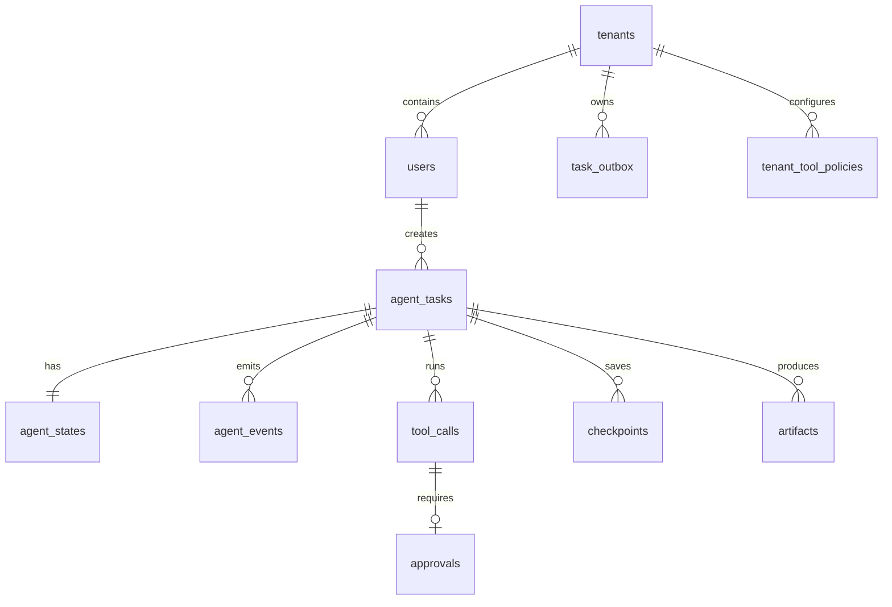

# 第二周数据库核心模型与数据访问层技术文档

## 1. 本周目标

第二周目标是把 Agent Runtime 从“服务骨架”推进到“可持久化核心业务数据”的阶段。本周完成的内容包括：

1. PostgreSQL 核心表设计和 migration。
2. 任务、状态、事件、工具调用、checkpoint、审批、artifact、outbox、租户和用户基础表。
3. PostgreSQL enum 状态模型。
4. tenant 隔离字段和组合外键约束。
5. sqlc 查询文件和类型安全 Go 代码生成。
6. pgx 连接池封装。
7. Task、Event、State、ToolCall、Checkpoint Repository 基础代码。
8. Repository 单元测试。
9. migration up/down 验证。

本周交付物主要服务于后续第 3 周到第 13 周的业务闭环：创建任务、查询 timeline、恢复状态、工具调用幂等、人工审批、artifact 管理和 outbox 可靠投递。

## 2. 代码与文件位置

| 文件或目录 | 作用 |
| --- | --- |
| `db/migrations/000002_week2_core_models.up.sql` | 创建第 2 周全部核心表、enum、索引和约束 |
| `db/migrations/000002_week2_core_models.down.sql` | 回滚第 2 周核心表和 enum |
| `sqlc.yaml` | sqlc 生成配置 |
| `db/queries/*.sql` | 类型安全 SQL 查询定义 |
| `internal/infra/postgres/db/*.go` | sqlc 生成的 Go 类型和查询代码 |
| `internal/infra/postgres/postgres.go` | pgxpool 连接池封装 |
| `internal/infra/postgres/repository/*.go` | Repository 基础层 |
| `internal/infra/postgres/repository/repository_test.go` | Repository 单元测试 |

## 3. 数据模型总览

本周新增 11 张表：

| 表名 | 业务含义 |
| --- | --- |
| `tenants` | 租户基础表，一个租户对应一个隔离边界 |
| `users` | 用户基础表，用户从属于租户 |
| `agent_tasks` | Agent 长任务主表 |
| `agent_states` | Agent 当前可恢复状态 |
| `agent_events` | Agent 执行 timeline 事件表 |
| `tool_calls` | 工具调用记录与幂等表 |
| `checkpoints` | 可恢复执行 checkpoint 快照 |
| `approvals` | 高风险工具调用审批记录 |
| `artifacts` | 任务产物元数据表 |
| `task_outbox` | 可靠异步消息 outbox 表 |
| `tenant_tool_policies` | 租户级工具权限策略表 |

核心关系如下：



## 4. 状态枚举设计

状态字段没有使用任意字符串，而是使用 PostgreSQL enum。这样数据库层可以直接拒绝非法状态，sqlc 也会生成对应 Go 枚举类型。

| enum | 取值 | 用途 |
| --- | --- | --- |
| `tenant_status` | `ACTIVE`、`SUSPENDED`、`DELETED` | 租户生命周期 |
| `user_status` | `ACTIVE`、`DISABLED`、`DELETED` | 用户生命周期 |
| `task_status` | `QUEUED`、`RUNNING`、`WAITING_APPROVAL`、`PAUSED`、`CANCELING`、`CANCELED`、`SUCCEEDED`、`FAILED` | AgentTask 生命周期 |
| `tool_call_status` | `PENDING`、`RUNNING`、`WAITING_APPROVAL`、`SUCCEEDED`、`FAILED`、`CANCELED` | 工具调用生命周期 |
| `approval_status` | `PENDING`、`APPROVED`、`REJECTED`、`EXPIRED`、`CANCELED` | 审批生命周期 |
| `risk_level` | `LOW`、`MEDIUM`、`HIGH`、`CRITICAL` | 工具风险等级 |
| `outbox_status` | `PENDING`、`PROCESSING`、`SENT`、`FAILED`、`DEAD` | outbox 投递状态 |
| `artifact_type` | `TEXT`、`JSON`、`FILE`、`IMAGE`、`REPORT`、`OTHER` | artifact 类型 |
| `artifact_status` | `AVAILABLE`、`DELETED` | artifact 可见状态 |
| `tool_policy_effect` | `ALLOW`、`DENY`、`REQUIRE_APPROVAL` | 租户工具策略结果 |

sqlc 在 `internal/infra/postgres/db/models.go` 中生成了这些枚举的 Go 类型，例如 `db.TaskStatus`、`db.ToolCallStatus`、`db.ApprovalStatus`。

## 5. 多租户隔离设计

设计方案要求所有核心表必须带 `tenant_id`，所有查询必须校验 `tenant_id`。本周实现方式如下：

1. `tenants.tenant_id` 是租户主键。
2. `users` 使用 `(tenant_id, user_id)` 作为联合主键，避免不同租户用户 ID 混用。
3. `agent_tasks` 保留全局 `task_id` 主键，同时增加 `(tenant_id, task_id)` 唯一约束。
4. `agent_states`、`agent_events`、`tool_calls`、`checkpoints`、`approvals`、`artifacts` 都通过 `(tenant_id, task_id)` 外键指向 `agent_tasks`。
5. `tool_calls` 额外有 `(tenant_id, call_id)` 唯一约束，审批表通过这个组合外键引用工具调用，避免跨租户审批。
6. sqlc 查询文件中的核心读取和更新查询全部带 `tenant_id` 条件。

这套设计的效果是：即使调用方传入了另一个租户的 `task_id` 或 `call_id`，SQL 查询也不会返回数据；写入时如果租户不匹配，数据库外键也会拒绝。

## 6. 核心表说明

### 6.1 tenants

`tenants` 是租户基础表。后续鉴权中间件会从 JWT 中解析租户 ID，业务查询再使用该租户 ID 访问数据。

关键字段：

| 字段 | 说明 |
| --- | --- |
| `tenant_id` | 租户 ID，主键 |
| `name` | 租户名称 |
| `status` | 租户状态 |
| `metadata` | 租户扩展信息，JSON object |
| `created_at`、`updated_at` | 创建和更新时间 |

关键约束：

1. `tenant_id` 和 `name` 不允许空白字符串。
2. `metadata` 必须是 JSON object。

### 6.2 users

`users` 是简化用户表，用于支撑任务创建人和多租户访问控制。

关键字段：

| 字段 | 说明 |
| --- | --- |
| `tenant_id` | 所属租户 |
| `user_id` | 用户 ID |
| `email` | 邮箱，同一租户内唯一 |
| `display_name` | 展示名，可为空 |
| `role` | 简化角色字段 |
| `status` | 用户状态 |
| `metadata` | 用户扩展信息 |

主键是 `(tenant_id, user_id)`，这表示用户身份在租户内唯一。索引 `idx_users_tenant_status` 支持后续按租户和用户状态查询。

### 6.3 agent_tasks

`agent_tasks` 是 Agent 长任务主表。任务创建、查询、取消、恢复和最终结果都以这张表为入口。

关键字段：

| 字段 | 说明 |
| --- | --- |
| `task_id` | 任务 ID，主键 |
| `tenant_id`、`user_id` | 租户和创建人 |
| `goal` | 用户目标 |
| `status` | 任务状态 |
| `budget` | 预算配置，例如最大 step、token、工具调用次数 |
| `budget_usage` | 预算消耗，例如已使用 step、token、工具调用次数 |
| `workflow_id` | Temporal workflow ID，后续接入 Temporal 后写入 |
| `trace_id` | 可观测链路 ID |
| `last_error_code`、`last_error_message` | 最近一次失败原因 |
| `created_at`、`updated_at` | 创建和更新时间 |

关键索引：

| 索引 | 用途 |
| --- | --- |
| `idx_agent_tasks_tenant_user_status` | 用户任务列表和状态过滤 |
| `idx_agent_tasks_status_updated` | Worker 扫描全局状态任务 |
| `idx_agent_tasks_tenant_status_updated` | 租户内按状态查询任务 |

### 6.4 agent_states

`agent_states` 保存 Agent 当前状态，供 Runtime Worker 中断后恢复。

关键字段：

| 字段 | 说明 |
| --- | --- |
| `task_id` | 与任务一对一 |
| `tenant_id` | 租户隔离字段 |
| `current_plan` | 当前计划，JSON object |
| `current_step` | 当前执行到第几个 step |
| `memory_summary` | 长任务记忆摘要 |
| `constraints` | 执行约束 |
| `artifacts` | 当前状态中引用的产物列表 |
| `loop_fingerprints` | 循环检测指纹 |
| `version` | 乐观锁版本 |
| `updated_at` | 状态更新时间 |

状态更新必须带 `version`：

```sql
where tenant_id = $tenant_id
  and task_id = $task_id
  and version = $version
```

如果没有更新到行，Repository 会返回 `ErrVersionConflict`。调用方应重新加载状态后再决定是否重试。

### 6.5 agent_events

`agent_events` 是 timeline 事件表，只追加，不修改。它记录任务执行过程中的关键动作，例如任务创建、模型调用、工具调用开始、工具调用完成、审批等待等。

关键字段：

| 字段 | 说明 |
| --- | --- |
| `event_id` | 自增事件 ID |
| `task_id`、`tenant_id` | 所属任务和租户 |
| `type` | 事件类型，例如 `TASK_CREATED` |
| `input`、`output` | 事件输入输出，JSONB |
| `metadata` | 事件扩展信息 |
| `trace_id`、`span_id` | 可观测追踪字段 |
| `created_at` | 事件时间 |

关键索引：

| 索引 | 用途 |
| --- | --- |
| `idx_agent_events_task_event` | 按任务顺序读取 timeline |
| `idx_agent_events_tenant_task_event` | 带租户隔离读取 timeline |
| `idx_agent_events_tenant_type_time` | 租户内按事件类型和时间查询 |

### 6.6 tool_calls

`tool_calls` 是工具调用记录表，也是工具幂等的核心表。所有工具调用必须先写入这张表，再由 Tool Gateway 执行。

关键字段：

| 字段 | 说明 |
| --- | --- |
| `call_id` | 工具调用 ID |
| `task_id`、`tenant_id`、`user_id` | 所属任务、租户和用户 |
| `tool_name` | 工具名称 |
| `arguments` | 工具参数，JSON object |
| `arguments_hash` | 参数归一化后的 hash |
| `idempotency_key` | 幂等键 |
| `status` | 工具调用状态 |
| `result` | 工具结果 |
| `result_artifact_id` | 大结果对应的 artifact ID |
| `risk_level` | 风险等级 |
| `approval_status` | 审批状态 |
| `error_code`、`error_message` | 失败原因 |
| `started_at`、`finished_at` | 执行开始和结束时间 |

关键约束：

1. `(tenant_id, idempotency_key)` 唯一，保证同一租户内重复工具调用不会产生重复副作用。
2. `arguments` 必须是 JSON object。
3. `result_artifact_id` 如果存在，必须指向 `artifacts`。

### 6.7 checkpoints

`checkpoints` 保存任务可恢复执行快照。Worker 在外部调用前后写 checkpoint，重启后可以从最近 checkpoint 恢复。

关键字段：

| 字段 | 说明 |
| --- | --- |
| `checkpoint_id` | checkpoint ID |
| `task_id`、`tenant_id` | 所属任务和租户 |
| `state_version` | 对应状态版本 |
| `event_offset` | 已处理到的事件偏移 |
| `state_snapshot` | 状态快照，JSON object |
| `reason` | 创建原因，例如 `BEFORE_TOOL_CALL` |
| `trace_id` | 可观测链路 ID |
| `created_at` | 创建时间 |

索引 `idx_checkpoints_tenant_task_created` 支持按任务查询最近 checkpoint。

### 6.8 approvals

`approvals` 保存高风险工具调用审批记录。一个工具调用最多对应一条审批记录。

关键字段：

| 字段 | 说明 |
| --- | --- |
| `approval_id` | 审批 ID |
| `task_id`、`tenant_id` | 所属任务和租户 |
| `call_id` | 被审批的工具调用 |
| `approver_id` | 审批人 |
| `status` | 审批状态 |
| `risk_level` | 风险等级 |
| `approval_reason` | 发起审批原因 |
| `comment` | 审批意见 |
| `expires_at` | 审批过期时间 |
| `decided_at` | 审批决策时间 |

关键索引：

| 索引 | 用途 |
| --- | --- |
| `idx_approvals_tenant_status` | 租户内审批列表 |
| `idx_approvals_approver_status` | 审批人待办列表 |

### 6.9 artifacts

`artifacts` 保存任务产物元数据。实际大文件后续会放到 MinIO/S3，本表保存访问路径、类型和权限隔离信息。

关键字段：

| 字段 | 说明 |
| --- | --- |
| `artifact_id` | 产物 ID |
| `tenant_id`、`task_id`、`user_id` | 所属租户、任务和用户 |
| `type` | 产物类型 |
| `name` | 产物名称 |
| `media_type` | MIME 类型 |
| `storage_backend` | 存储后端，默认 `MINIO` |
| `storage_key` | 对象存储 key |
| `content_json` | 小型 JSON 产物内容 |
| `size_bytes` | 产物大小 |
| `checksum_sha256` | 校验摘要 |
| `metadata` | 扩展信息 |
| `status` | 产物状态 |

约束要求 `storage_key` 或 `content_json` 至少有一个存在，避免创建空 artifact。

### 6.10 task_outbox

`task_outbox` 用于解决“数据库写成功，但消息或 Workflow 启动失败”的问题。业务事务先写入 outbox，后台 worker 再异步投递。

关键字段：

| 字段 | 说明 |
| --- | --- |
| `outbox_id` | 自增 ID |
| `tenant_id` | 租户 |
| `aggregate_type` | 聚合类型，例如 `AGENT_TASK` |
| `aggregate_id` | 聚合 ID，例如 task_id |
| `event_type` | 事件类型，例如 `START_WORKFLOW` |
| `payload` | 投递内容 |
| `status` | 投递状态 |
| `retry_count` | 重试次数 |
| `next_retry_at` | 下次重试时间 |

索引 `idx_task_outbox_status_retry` 支持后台 worker 扫描可重试消息。

### 6.11 tenant_tool_policies

`tenant_tool_policies` 是租户级工具权限策略表。Tool Gateway 执行工具前会按租户和工具名称读取策略。

关键字段：

| 字段 | 说明 |
| --- | --- |
| `policy_id` | 策略 ID |
| `tenant_id` | 租户 |
| `tool_name` | 工具名称 |
| `effect` | `ALLOW`、`DENY` 或 `REQUIRE_APPROVAL` |
| `max_risk_level` | 允许的最大风险等级 |
| `require_approval` | 是否强制审批 |
| `config` | 额外策略配置 |

`(tenant_id, tool_name)` 唯一，保证同一租户下一个工具只有一条生效策略。

## 7. sqlc 接入说明

本项目使用 `sqlc.yaml` 生成 `internal/infra/postgres/db`：

```yaml
sql_package: "pgx/v5"
emit_interface: true
emit_json_tags: true
emit_db_tags: true
```

重要配置说明：

1. `sql_package: "pgx/v5"`：生成代码直接适配 pgx，不经过 `database/sql`。
2. `emit_interface: true`：生成 `db.Querier` 接口，便于 Repository 和测试替换查询实现。
3. `jsonb` override 到 `encoding/json.RawMessage`：业务层可以原样保存 JSONB，不强制绑定到临时结构体。
4. nullable 字段启用指针：例如 nullable text 生成为 `*string`，更符合 Go 侧语义。

SQL 查询放在 `db/queries`，按聚合拆分：

| 文件 | 查询范围 |
| --- | --- |
| `tasks.sql` | 任务创建、查询、列表、状态更新 |
| `events.sql` | 事件追加和 timeline 查询 |
| `states.sql` | 状态创建、查询、乐观锁更新 |
| `tool_calls.sql` | 工具调用创建、幂等查询、开始、完成、失败 |
| `checkpoints.sql` | checkpoint 创建、查询最近快照 |
| `approvals.sql` | 审批创建和决策 |
| `artifacts.sql` | artifact 创建、查询、删除标记 |
| `outbox.sql` | outbox 创建、扫描、标记状态 |
| `policies.sql` | 租户工具策略 upsert 和查询 |
| `tenants.sql` | 租户和用户基础查询 |

生成命令：

```bash
make sqlc-generate
```

`Makefile` 中的 `SQLC_VERSION` 默认是 `latest`，也可以通过 `make sqlc-generate SQLC_VERSION=v1.31.1` 固定版本。本次生成使用的 sqlc 版本是 `v1.31.1`，生成文件头部已记录版本。

## 8. pgx 接入说明

`internal/infra/postgres/postgres.go` 提供 `NewPool` 方法，用于创建 `pgxpool.Pool`。

设计点：

1. 连接串来自 `config.Config.DatabaseURL`。
2. 支持配置 `MaxConns`、`MinConns`、连接生命周期和空闲时间。
3. 创建连接池后立即 `Ping`，避免服务启动成功但数据库不可用。
4. 返回错误包含上下文信息，便于启动日志定位。

典型使用方式：

```go
pool, err := postgres.NewPool(ctx, postgres.PoolConfig{
    DatabaseURL: cfg.DatabaseURL,
    MaxConns:    10,
})
queries := db.New(pool)
taskRepo := repository.NewTaskRepository(queries)
```

## 9. Repository 层实现说明

Repository 位于 `internal/infra/postgres/repository`。它不拼 SQL，不实现业务流程，只负责：

1. 调用 sqlc 生成的类型安全查询。
2. 统一错误语义。
3. 隐藏 pgx 细节，避免上层直接依赖 `pgx.ErrNoRows`。
4. 以聚合为单位暴露数据库访问入口。

当前实现了 5 个 Repository：

| Repository | 主要方法 |
| --- | --- |
| `TaskRepository` | `Create`、`Get`、`ListByTenant`、`UpdateStatus`、`UpdateWorkflow`、`UpdateBudgetUsage`、`MarkFailed` |
| `EventRepository` | `Append`、`Get`、`ListByTask`、`ListByType` |
| `StateRepository` | `Create`、`Get`、`UpdateOptimistic` |
| `ToolCallRepository` | `Create`、`Get`、`GetByIdempotencyKey`、`Start`、`Complete`、`Fail`、`UpdateApprovalStatus` |
| `CheckpointRepository` | `Create`、`Get`、`Latest`、`ListByTask` |

统一错误：

| 错误 | 触发场景 |
| --- | --- |
| `ErrNotFound` | 查询、更新目标不存在 |
| `ErrVersionConflict` | `agent_states` 乐观锁更新失败 |

`StateRepository.UpdateOptimistic` 会把 `pgx.ErrNoRows` 映射为 `ErrVersionConflict`。这是因为该更新语句同时校验 `tenant_id`、`task_id` 和 `version`，没有返回行代表状态版本已经被其他执行流改动，调用方必须重新读取。

## 10. 测试说明

Repository 单元测试在 `internal/infra/postgres/repository/repository_test.go`。

覆盖内容：

1. `pgx.ErrNoRows` 到 `ErrNotFound` 的错误映射。
2. 普通数据库错误保持原始错误。
3. `TaskRepository.Get` 的租户和任务参数透传。
4. `EventRepository.Append` 的事件参数透传。
5. `StateRepository.UpdateOptimistic` 的版本冲突映射。
6. `ToolCallRepository.GetByIdempotencyKey` 的幂等查询参数透传。
7. `CheckpointRepository.Latest` 的租户和任务参数透传。

这些测试使用 fake query 对象，不依赖真实 PostgreSQL。真实数据库结构通过 migration up/down 验证。

## 11. migration 验证结果

已在本地 Docker Compose PostgreSQL 容器中验证：

```bash
./scripts/migrate.sh status
./scripts/migrate.sh up
./scripts/migrate.sh down
./scripts/migrate.sh up
./scripts/migrate.sh status
```

最终版本表状态：

| version | filename |
| --- | --- |
| `000001` | `000001_week1_baseline.up.sql` |
| `000002` | `000002_week2_core_models.up.sql` |

这说明：

1. 第 2 周 up migration 可以完整创建 enum、表、索引和约束。
2. 第 2 周 down migration 可以完整回滚。
3. 回滚后再次 up 可以成功执行。
4. 当前本地数据库最终停留在最新 schema。

## 12. 后续接入建议

第 3 周实现任务 API 时，应按以下顺序使用本周能力：

1. 从鉴权上下文读取 `tenant_id` 和 `user_id`，不要信任请求体中的租户字段。
2. 创建任务时写入 `agent_tasks`。
3. 同事务创建 `agent_states` 初始状态。
4. 同事务追加 `agent_events` 的 `TASK_CREATED` 事件。
5. 同事务写入 `task_outbox` 的 `START_WORKFLOW` 消息。
6. API 查询任务和 timeline 时始终带 `tenant_id`。

第 9 周 Tool Gateway 接入时，应复用：

1. `tenant_tool_policies` 做工具权限判断。
2. `tool_calls` 的 `(tenant_id, idempotency_key)` 唯一约束做幂等。
3. 高风险工具写入 `approvals` 并把工具状态置为 `WAITING_APPROVAL`。

第 13 周 Artifact 和 Outbox 接入时，应复用：

1. `artifacts` 保存产物元数据和对象存储 key。
2. `task_outbox` 扫描 `PENDING` 或 `FAILED` 消息，并按 `retry_count`、`next_retry_at` 重试。
